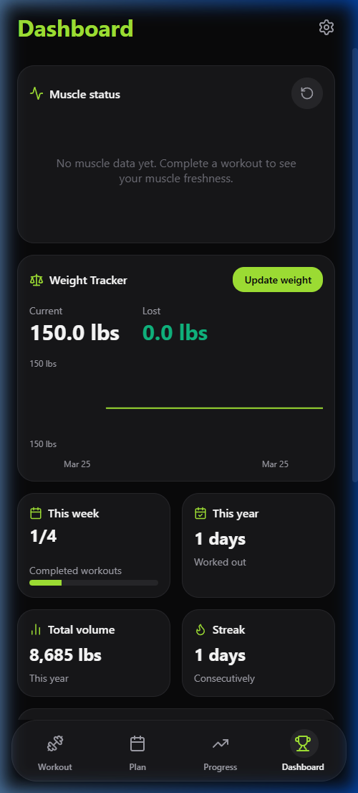
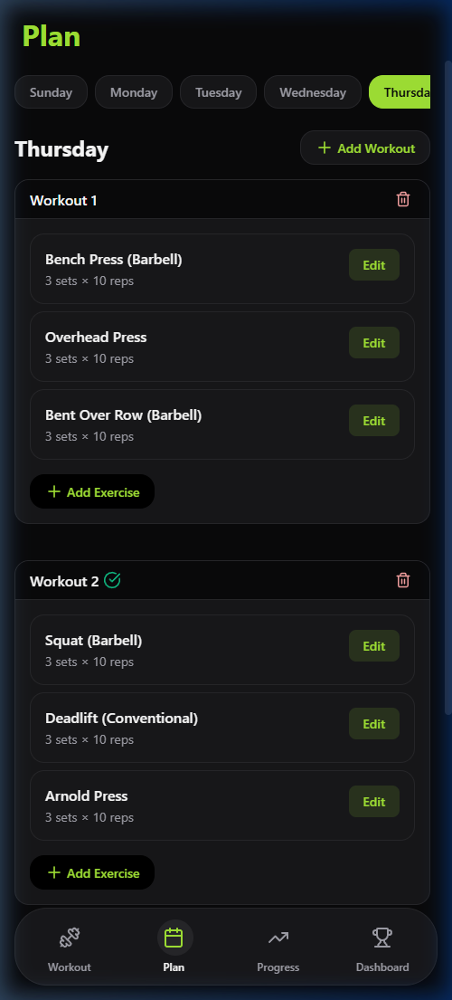
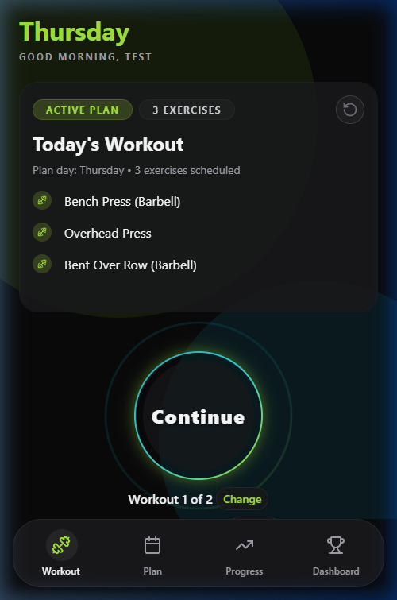
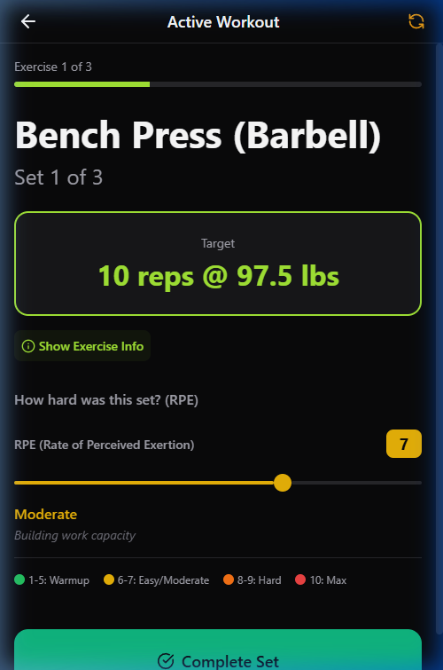
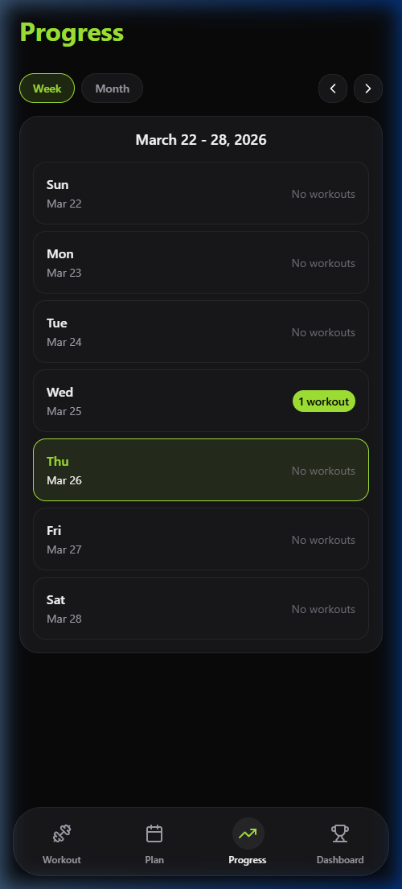

# IronPath

**A science-driven fitness platform that treats the human body as an integrated system, not a collection of isolated parts.**

IronPath represents a fundamental shift from traditional fitness apps that rely on generic templates and isolated muscle tracking. Instead, we've built a sophisticated system grounded in exercise science, biomechanics, and mathematical modeling to deliver truly personalized, effective training programs.

> **Note:** Active development occurs on the `V2-Dev` branch. The main branch represents the stable production-ready version.

## 🧬 What Makes IronPath Different

### Science-Based Methodology

Unlike apps that use arbitrary defaults (e.g., "3 sets of 10 reps"), IronPath employs **curated exercise prescriptions** derived from exercise science literature. Every target—sets, reps, duration, and rest periods—comes from evidence-based programming principles tailored to experience level and movement mode. New users receive data-driven starting points, while experienced users benefit from progressive overload algorithms that adapt based on their actual performance history.

### Natural Movement Philosophy

**We treat the body as a compound whole, not machine parts.** Our muscle model focuses on **29 functionally distinct muscle groups** organized by movement patterns (push, pull, core, lower body) rather than isolating individual muscle heads. This approach recognizes that:

- Compound movements engage multiple muscles in coordinated patterns
- Stabilizers and secondary muscles play critical roles in movement quality
- Functional groups (e.g., "upper body push") better reflect real-world movement than isolated tracking

Exercises are analyzed through **primary muscles** (weight = 1.0) and **implicit hits** (weighted 0-1.0) to capture the full biomechanical picture of each movement. This holistic view enables accurate fatigue modeling and prevents overtraining specific muscle groups.

### Mathematical Precision

IronPath uses **rigorously defined formulas** for all critical calculations:

- **Fatigue Modeling**: `stimulus = clamp((RPE - 5) / 5, 0, 1)` converts perceived exertion into normalized stress values
- **Muscle Stress Accumulation**: `muscle_stress(m) = Σ(stimulus × normalized_muscle_weight)` across all sets
- **Progressive Overload**: Weight increases (2.5% increments) and rep progressions based on effort signals (RPE ≤ 7 triggers weight increase)
- **Density Calculations**: Time estimates account for set count, rest periods, and unilateral doubling
- **Fatigue Zones**: Green (≤50% stress), Yellow (50-85%), Red (>85% hard stop) guide exercise selection

These algorithms power our **in-flight fatigue simulation** during workout generation, ensuring exercises are selected to balance muscle stress across the week while respecting recovery needs.

### Intelligent Automation Meets Personalization

IronPath strikes a delicate balance: **algorithms handle the heavy lifting, but users remain in control.**

- **Automated**: Target selection, progressive overload, fatigue-aware exercise recommendations, muscle rebalancing
- **Customizable**: User overrides for any exercise, custom exercise creation, template editing, experience-level adjustments

The system learns from performed truth (what you actually did) to refine future recommendations, creating a feedback loop that gets smarter over time. Users can override any algorithm decision, but the defaults are informed by science, not guesswork.

### Curated, Not Generic

Every exercise in IronPath includes:
- **Density scores** for workout efficiency optimization
- **Time models** (setup buffers, average time per set) for realistic session planning
- **Prescription bands** (sets_min/max, reps_min/max, duration ranges) that define safe, effective training zones
- **Biomechanical metadata** (primary muscles, implicit hits) for accurate stress tracking

This curated approach ensures users never see meaningless defaults—every number has a purpose and scientific backing.

## 🚀 Key Features

- **Prescription-Based Programming**: All workout targets derive from curated exercise prescriptions, eliminating generic defaults
- **Muscle Stress Heatmap**: Real-time visualization of muscle fatigue and recovery status across 29 functionally organized muscle groups
- **Progressive Overload Engine**: Mathematical algorithms that adjust weight, reps, and duration based on RPE/RIR signals and historical performance
- **Fatigue-Aware Week Generation**: AI-powered exercise selection that simulates muscle stress in real-time to prevent overtraining
- **Custom Exercise Support**: Users can create and track custom exercises with full biomechanical modeling support
- **Workout Templates**: Flexible weekly planning system with drag-and-drop exercise management
- **Session Tracking**: Comprehensive workout logging with sets, reps, weight, RPE, and RIR tracking
- **Recovery Analytics**: Derived muscle freshness and stress metrics using validated fatigue decay formulas

## 📸 App Showcase

> **Note:** These screenshots were captured using a local web preview environment. IronPath is a meticulously designed native mobile application, so rendering, animations, and UI elements (like SVG timers and shadow formatting) may look slightly different on physical iOS and Android devices.

### 1. Intelligent User Dashboard
The dashboard dynamically updates to reflect your latest readiness and muscle freshness based on decay algorithms.


### 2. Adaptive Weekly Planner & AI Generation
Start with a clean slate or let the AI cascade your fatigue metrics across the week to prescribe optimal routines.


### 3. Active Workout Tracking
The Daily Workout tab natively hosts your active workout containers for the day. Click "Start" to immerse yourself into the execution interface.


Execute your session cleanly with built-in rest timers, real-time history tracking, and inline RPE/RIR logging. You can even easily add ad-hoc "Today Only" exercises to your active container mid-workout without permanently mutating your master weekly blueprint!


### 4. Mathematical Progress Tracking
All executed volume is natively indexed into your tracking timeline. The Engine uses your logged 'Rate of Perceived Exertion' (RPE) against your prescribed rep bands to automatically stair-step your targets for next week!


## 🛠️ Tech Stack

### Frontend
- **React Native** (0.81.5) with **Expo** (~54.0.25)
- **Expo Router** (~6.0.15) - File-based routing with stack navigation
- **TypeScript** (5.9.2) - Full type safety across the codebase
- **NativeWind** (2.0.11) - Tailwind CSS for React Native
- **Zustand** (5.0.2) - Lightweight state management
- **React Native Reanimated** (4.1.5) - Smooth animations and gestures

### Backend & Database
- **Supabase** - PostgreSQL database with Row Level Security (RLS)
- **Supabase Auth** - Email/password authentication with secure session management
- **Supabase Edge Functions** - `generate-workout` (OpenAI-powered week generation), `update-muscle-freshness`, `delete-account`
- **RLS Policies** - Client-side security with anon key, no service role exposure
- **Type-Safe Queries** - Generated TypeScript types from database schema

### Architecture Patterns
- **Data Layering**: Canonical reference → Prescriptions → User customization → Planning → Performed truth
- **Global UI State**: Zustand-managed bottom sheets and modals (no modal-in-modal anti-pattern)
- **Separation of Concerns**: Clear boundaries between UI, business logic, and data access
- **Immutable Master Data**: Exercise and prescription data protected from client-side mutations
- **Derived Caches**: Computed muscle stress and freshness metrics for performance

## 📁 Project Structure

```
├── app/                    # Expo Router screens (file-based routing)
│   ├── (tabs)/            # Tab navigation screens
│   ├── (stack)/           # Stack navigation screens
│   └── auth/              # Authentication flows
├── src/
│   ├── components/        # Reusable UI components
│   │   ├── ui/           # Global UI (Toast, BottomSheet, ModalManager)
│   │   ├── exercise/     # Exercise-related components
│   │   ├── settings/     # Settings components
│   │   └── workout/      # Workout components
│   ├── hooks/            # Custom React hooks
│   ├── lib/
│   │   ├── engine/       # Business logic (target selection, rebalancing)
│   │   ├── supabase/     # Database queries and client
│   │   └── utils/        # Utilities (logger, validation, theme)
│   ├── stores/           # Zustand state management
│   └── types/            # TypeScript type definitions
├── supabase/
│   ├── migrations/       # Database migrations (versioned)
│   ├── functions/        # Edge Functions (generate-workout, update-muscle-freshness, ...)
│   └── seed/             # Master exercise/stretch seed CSV
├── scripts/               # Dev/ops tooling (exercise import, image generation)
└── documentation/         # Comprehensive architecture docs
```

## 🏗️ Architecture Highlights

### Data Layer Architecture
The application follows a strict 6-layer data model:
1. **Canonical Reference**: Immutable master data (exercises, muscles)
2. **Curated Prescriptions**: Exercise targets by experience level and mode
3. **User Customization**: Personal overrides and custom exercises
4. **Planning**: Workout templates and weekly schedules
5. **Performed Truth**: Actual workout sessions and sets (source of truth)
6. **Derived Caches**: Computed metrics (muscle stress, freshness)

### State Management
- **Zustand Stores**: Lightweight, performant state management
  - `uiStore`: Global UI state (bottom sheets, toasts, dialogs)
  - `userStore`: User profile and preferences cache

### Security & Data Integrity
- **Row Level Security (RLS)**: All database access controlled via RLS policies
- **Client-Side Security**: Anon key only, no service role in client code
- **Type Safety**: Database schema generates TypeScript types automatically
- **Validation**: Comprehensive input validation for all user data

### Developer Experience
- **Structured Logging**: Dev-only logging with `devLog()` for diagnostics
- **Type Generation**: Automated TypeScript types from Supabase schema
- **Theme System**: Centralized design tokens (colors, spacing, typography)
- **Error Handling**: Graceful error handling with user-friendly feedback

## 📊 Database Schema

The application uses a comprehensive PostgreSQL schema with 15+ tables:

- **Master Data**: `v2_exercises`, `v2_muscles`, `v2_exercise_prescriptions`
- **User Data**: `v2_profiles`, `v2_user_exercise_overrides`, `v2_user_custom_exercises`
- **Planning**: `v2_workout_templates`, `v2_template_days`, `v2_template_slots`
- **Tracking**: `v2_workout_sessions`, `v2_session_exercises`, `v2_session_sets`
- **Analytics**: `v2_muscle_freshness`, `v2_daily_muscle_stress`

All tables follow strict naming conventions (lowercase snake_case) and include proper foreign keys, constraints, and RLS policies.

## 🚦 Getting Started

### Prerequisites
- Node.js 20+
- npm
- Expo CLI (via `npx expo`)
- Supabase account and project
- Xcode 16+ (iOS) / Android Studio (Android)

### Installation

1. Clone the repository:
```bash
git clone https://github.com/yourusername/iron-path-app.git
cd iron-path-app
```

2. Install dependencies:
```bash
npm install
```

3. Set up environment variables:
```bash
EXPO_PUBLIC_SUPABASE_URL=your_supabase_url
EXPO_PUBLIC_SUPABASE_ANON_KEY=your_anon_key
```

4. Run database migrations:
```bash
# Apply migrations in order from supabase/migrations/
# Use Supabase CLI or dashboard
```

5. Deploy edge functions (with `OPENAI_API_KEY` set as a Supabase secret):
```bash
npx supabase functions deploy generate-workout
npx supabase functions deploy update-muscle-freshness
npx supabase functions deploy delete-account
npx supabase functions deploy revenuecat-webhook
```

6. Generate TypeScript types:
```bash
npx supabase gen types typescript --project-id your_project_id > src/types/supabase.gen.ts
```

7. Start the development server:
```bash
npm start            # web / Expo Go
npm run start:dev    # dev-client server
npx expo run:ios     # build & run the native iOS dev build
```

See [documentation/SETUP_GUIDE.md](./documentation/SETUP_GUIDE.md) for the full walkthrough.

## 📚 Documentation

Comprehensive documentation is available in the `documentation/` directory (see [00_INDEX.md](./documentation/00_INDEX.md)):

- **[SYSTEM_ARCHITECTURE.md](./documentation/SYSTEM_ARCHITECTURE.md)**: Complete system contract and architectural decisions
- **[DATABASE_SCHEMA.md](./documentation/DATABASE_SCHEMA.md)**: Tables, RLS policies, and type generation
- **[ALGORITHMS.md](./documentation/ALGORITHMS.md)**: Fatigue modeling, progression, and generation formulas
- **[DATA_FLOWS.md](./documentation/DATA_FLOWS.md)**: End-to-end data flow patterns
- **[SETUP_GUIDE.md](./documentation/SETUP_GUIDE.md)**: From-scratch setup walkthrough
- **[IMPLEMENTATION_STATUS.md](./documentation/IMPLEMENTATION_STATUS.md)**: Implementation tracking

## 🎯 Key Technical Achievements

### Scientific & Algorithmic Innovation
- **Mathematical Fatigue Modeling**: RPE/RIR-based stimulus calculations with normalized muscle weighting for accurate stress tracking
- **In-Flight Fatigue Simulation**: Real-time muscle stress accumulation during workout generation prevents overtraining
- **Progressive Overload Algorithms**: Data-driven weight and rep progression based on effort signals and historical performance
- **Curated Prescription System**: Evidence-based target bands replace generic defaults across all exercises
- **Biomechanical Modeling**: 29-muscle functional group system with primary/implicit hit weighting for compound movement analysis

### Engineering Excellence
- **Type-Safe Database Queries**: Full TypeScript coverage with generated types from Supabase schema
- **Performance Optimization**: Efficient queries with proper indexing and derived caches for real-time calculations
- **Scalable Architecture**: Clean separation of concerns enabling easy feature additions and algorithm refinements
- **Data Integrity**: Comprehensive validation, RLS policies, and immutable master data ensure consistency
- **Developer Experience**: Structured logging, type safety, and comprehensive documentation for maintainability

## 🔄 Development Workflow

Active development and new features are implemented on the `V2-Dev` branch. The main branch represents stable, production-ready code. All changes go through:

1. Development on `V2-Dev`
2. Testing and validation
3. Merge to main after review

## 📱 Platform Support

- **iOS**: Native iOS app with full feature support
- **Android**: Native Android app with Material Design
- **Web**: Progressive Web App (PWA) support

## 🤝 Contributing

This is a personal project, but suggestions and feedback are welcome. For major changes, please open an issue first to discuss what you would like to change.

## 📄 License

This project is private and proprietary.

---

**Built with ❤️ using React Native, Expo, and Supabase**

